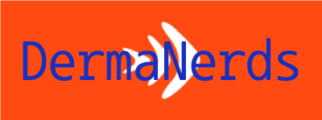
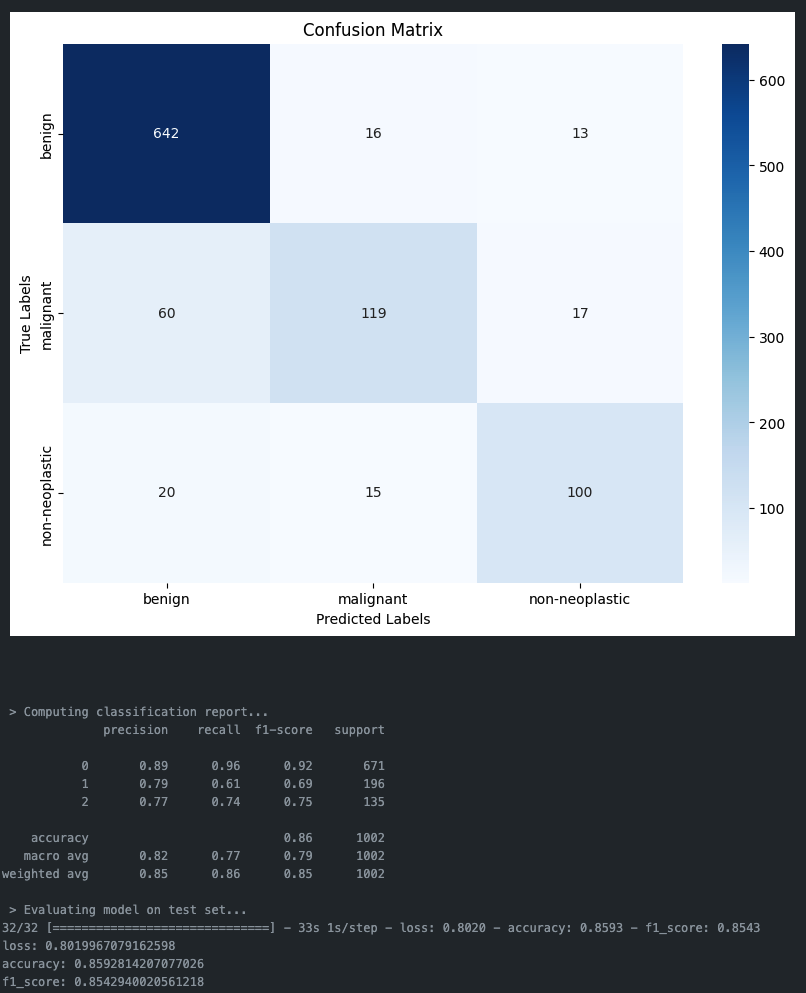

# Team DermaNerds Capstone Project



## Convolutional Neural Network Image Classification of Pigmented Skin Lesions


# DermaNerds Capstone Project

This is the capstone project for the Data Science bootcamp of neuefische GmbH ffm-ds-23, where the task was to utilize the knowledge from the bootcamp to solve an everyday problem.

The teams were self-organized, and the topics were chosen by the trainees themselves. Team DermaNerds formed from a shared passion for using neural networks in life sciences and healthcare applications. They chose the HAM10000 ("Human Against Machine with 10000 training images") dataset for this project as a stellar example of image classification in medicine.

The HAM10000 dataset addresses the challenge of training neural networks for automated skin lesion diagnosis by providing a diverse collection of 10,015 dermatoscopic images from different populations, modalities, and diagnostic categories, making it a valuable resource for academic machine learning research in this field. These images encompass seven different types of skin lesions, offering a comprehensive training ground for machine learning algorithms.

To tackle the classification challenge, the team focused on utilizing ResNet-50, a deep convolutional neural network known for its superior accuracy, reduced overfitting, and ease of transfer learning. ResNet-50's architecture, with its residual learning framework, helps mitigate the vanishing gradient problem, which is particularly beneficial when training on large and complex datasets like HAM10000. After comparing other CNN architectures such as VGG16 and MobileNet, ResNet-50 demonstrated the best performance on the dataset.

## Project Workflow

The project workflow involved several key steps:

1. **Data Preprocessing**: The team performed extensive data cleaning and augmentation to ensure the dataset was in optimal condition for training. This included handling missing values, normalizing image data, and applying various augmentation techniques to increase the diversity of the training set.

2. **Metadata Engineering**: The metadata associated with the images, such as age, gender, and localization of the lesions, was carefully analyzed and used to group the classes into three main categories: "benign," "malignant," and "non-neoplastic." This grouping helped streamline the classification process and improve model accuracy.

3. **Model Training**: ResNet-50 was trained on the preprocessed dataset, leveraging transfer learning to take advantage of pre-trained weights. The model was fine-tuned with the specific characteristics of the HAM10000 dataset to enhance its performance.

4. **Evaluation and Validation**: The final evaluations were performed on the three classes. The model's performance was rigorously tested using various metrics, including accuracy, precision, recall, and the F1-score, to ensure it met the desired benchmarks.

5. **Deployment and Future Work**: The trained model was then prepared for deployment, with considerations for real-world application in clinical settings. The team also outlined potential future work, such as expanding the dataset, incorporating additional features from the metadata, and exploring other neural network architectures to further improve classification accuracy.

Overall, the DermaNerds' project exemplifies the practical application of advanced machine learning techniques in addressing real-world healthcare challenges, showcasing the potential for neural networks to assist in medical diagnosis and improve patient outcomes.


### Workflow

#### Environment Setup

Use the requirements file in this repo to create a new environment.

```BASH
make setup

#or

pyenv local 3.11.3
python -m venv .venv
source .venv/bin/activate
pip install --upgrade pip
pip install -r requirements.txt
```

#### Image Folder path

- unpack all jpgs from HAM10000_images_part1.zip (5000 JPEG files) &
HAM10000_images_part2.zip (5015 JPEG files) to:  
./Capstone-Healthy-Skin/data/jpgs

#### Metadata Folder path

- unpack HAM10000_metadata.tab to: ./Capstone-Healthy-Skin/data
- The notebook "0_metadata_engineering" can be used to group lesion type dx into three classes, otherwise 7 classes is the default.

#### Notebook usage

##### 1_image_loader_Albumentation

- This notebook utilizes the [Albumentation](https://albumentations.ai/) library to resample the classes with augmented images. Possible settings for Target_label are: dx(7 classes), dx_binary(2 classes), dx_tertiary(3 classes)
- The image_loader will automatically reduce/increase samples per class as stated in MAX_SAMPLES_TRAIN
  
##### 2_run_tertiary_resnet50

- This notebook will preprocces the train data e.g. centering and cropping
- It will also randomly augment the train data to improve learning
- It contains the optimized resnet50 model architecture and the model training
- After training the model is evaluated using the modelhelper helperfunction
- Finally the model is saved as an .h5 for future comparisons
  
##### 3_loading_models

- This notebook can load previously saved models for re-evaluation
- It will load all saved models in a given directory for easy comparison

#### Performance

In this 4 week project the following was achieved:



#### The Team

- [Arathi Ramesh](https://github.com/eigenaarti2)
- [Björn Zimmermann](https://github.com/bjzim)
- [Daniel Marques Rodrigues](https://github.com/Da-MaRo)
- [Janice Pelzer](https://github.com/janicepelzer)
- [Stefan Berkenhoff](https://github.com/StefanK2ff)

#### The Coaches

- [Aljoscha Wilhelm](https://github.com/JodaFlame)
- [Arjun Haridas](https://github.com/Ajax121)
- [Evgeny Savin](https://github.com/EvgenySavin1985)
